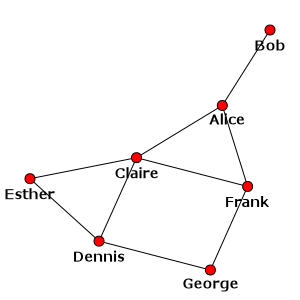
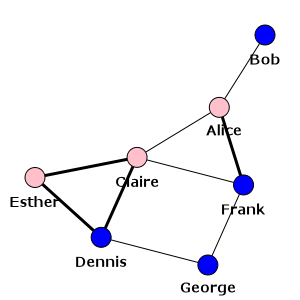

.. include:: include/global.rst

.. Tutorial

========
Tutorial
========

This chapter contains a short overview of |igraph|'s capabilities. It is highly recommended
to read it at least once if you are new to |igraph|. I assume that you have already installed
|igraph|; if you did not, see :ref:`installing-igraph` first. Familiarity with the Python
language is also assumed; if this is the first time you are trying to use Python, there are
many good Python tutorials on the Internet to get you started. Mark Pilgrim's
`Dive Into Python <http://www.diveintopython.net>`_ is one that I personally suggest.
If this is the first time you ever try to use a programming language,
`A Byte of Python <http://swaroopch.com/notes/Python>`_ is even better. If
you already have a stable programming background in other languages and you just want a
quick overview of Python, `Learn Python in 10 minutes
<http://www.poromenos.org/tutorials/python>`_ is probably your best bet.

Starting |igraph|
=================

|igraph| is a Python module, hence it can be imported exactly the same way as any other
ordinary Python module at the Python prompt::

  $ python
  Python 2.7.1 (r271:86832, Jun 16 2011, 16:59:05)
  [GCC 4.2.1 (Based on Apple Inc. build 5658) (LLVM build 2335.15.00)] on darwin
  Type "help", "copyright", "credits" or "license" for more information.
  >>> import igraph

This imports |igraph|'s objects and methods inside an own namespace called :mod:`igraph`. Whenever
you would like to call any of |igraph|'s methods, you will have to provide the appropriate
namespace-qualification. E.g., to check which |igraph| version you are using, you could do the
following:

>>> import igraph
>>> print igraph.__version__
0.6

Another way to make use of |igraph| is to import all its objects and methods into the main
Python namespace (so you do not have to type the namespace-qualification every time).
This is fine as long as none of your own objects and methods do not conflict with the ones
provided by |igraph|:

>>> from igraph import *

The third way to start |igraph| is to simply call the startup script that was supplied with
the |igraph| package you installed. Not too surprisingly, the script is called :command:`igraph`,
and provided that the script is on your path in the command line of your operating system
(which is almost surely the case on Linux and OS X), you can simply type :command:`igraph` at the
command line. Windows users will find the script inside the :file:`scripts` subdirectory of Python
and you may have to add it manually to your path in order to be able to use the script from
the command line without typing the whole path.

When you start the script, you will see something like this::

  $ igraph
  No configuration file, using defaults
  igraph 0.6 running inside Python 2.7.1 (r271:86832, Jun 16 2011, 16:59:05)
  Type "copyright", "credits" or "license" for more information.
  >>>

The command-line startup script imports all of |igraph|'s methods and objects into the main
namespace, so it is practically equivalent to ``from igraph import *``. The difference between
the two approaches (apart from saving some typing) is that the command-line script checks
whether you have any of Python's more advanced shells installed and uses that instead of the
standard Python shell. Currently the module looks for `IPython <http://ipython.scipy.org>`_ and
IDLE (the Tcl/Tk-based graphical shell supplied with Python). If neither IPython nor IDLE is
installed, the startup script launches the default Python shell. You can also modify the
order in which these shells are searched by tweaking |igraph|'s configuration file
(see :ref:`configuring-igraph`).

In general, it is advised to use the command line startup script when using |igraph|
interactively (i.e., when you just want to quickly load or generate some graphs, calculate
some basic properties and save the results somewhere). For non-disposable graph analysis
routines that you intend to re-run from time to time, you should write a script separately
in a ``.py`` source file and import |igraph| using one of the above methods at the start of
the script, then launch the script using the Python interpreter.

From now on, every example in the documentation will assume that |igraph|'s objects and
methods are imported into the main namespace (i.e., we used ``from igraph import *``
instead of ``import igraph``). If you let |igraph| take its own namespace, please adjust
all the examples accordingly.

Creating a graph from scratch
=============================

Assuming that you have started |igraph| successfully, it is time to create your first
|igraph| graph. This is pretty simple:

>>> g = Graph()

The above statement created an undirected graph with no vertices or edges and assigned it
to the variable `g`. To confirm that it's really an |igraph| graph, we can
print it:

>>> g
<igraph.Graph object at 0x4c87a0>

This tells us that `g` is an instance of |igraph|'s :class:`Graph` class and
that it is currently living at the memory address ``0x4c87a0`` (the exact
output will almost surely be different for your platform). To obtain a more
user-friendly output, we can try to print the graph using Python's
``print`` statement:

>>> print(g)
IGRAPH U--- 0 0 --

TODO: explain it

This is not too exciting so far; a graph with a single vertex and no edges is not really useful
for us. Let's add some vertices first!

>>> g.add_vertices(3)

:meth:`Graph.add_vertices` (i.e., the :meth:`~Graph.add_vertices` method of the :class:`Graph`
class) adds the given number of vertices to the graph.

Now our graph has three vertices but no edges, so let's add some edges as well! You can
add edges by calling :meth:`Graph.add_edges` - but in order to add edges, you have to refer to
existing vertices somehow. |igraph| uses integer vertex IDs starting from zero, thus the
first vertex of your graph has index zero, the second vertex has index 1 and so on.
Edges are specified by pairs of integers, so ``[(0,1), (1,2)]`` denotes a list of two
edges: one between the first and the second, and the other one between the second and the
third vertices of the graph. Passing this list to :meth:`Graph.add_edges` adds these two edges
to your graph:

>>> g.add_edges([(0,1), (1,2)])

:meth:`~Graph.add_edges` is clever enough to figure out what you want to do in most of the
cases: if you supply a single pair of integers, it will automatically assume that you want
to add a single edge. However, if you try to add edges to vertices with invalid IDs (i.e.,
you try to add an edge to vertex 5 when you only have three edges), you will get an
exception:

>>> g.add_edges((5, 0))
Traceback (most recent call last):
  File "<stdin>", line 6, in <module>
igraph.core.InternalError: Error at ../../src/type_indexededgelist.c:245: cannot add edges, invalid vertex id

Most |igraph| functions will raise an :exc:`igraph.core.InternalError` if
something goes wrong. The message corresponding to the exception gives you a
short textual explanation of what went wrong (``cannot add edges, invalid
vertex id``) along with the corresponding line in the C source where the error
occurred. The exact filename and line number may not be too informative to you,
but it is invaluable for |igraph| developers if you think you found an error in
|igraph| and you want to report it.

Let us go on with our graph ``g`` and add some more vertices and edges to it:

>>> g.add_edges((2,0))
>>> g.add_vertices(3)
>>> g.add_edges([(2,3),(3,4),(4,5),(5,3)])
>>> print g
IGRAPH U---- 6 7 --
+ edges:
0--1 1--2 0--2 2--3 3--4 4--5 3--5

Now, this is better. We have an undirected graph with six vertices and seven
edges, and you can also see the list of edges in |igraph|'s output.  Edges also
have IDs, similarly to vertices; they also start from zero and edges that were
added later have higher IDs than edges that were added earlier. Vertex and edge
IDs are always *continuous*, and a direct consequence of this fact is that if
you happen to delete an edge, chances are that some (or all) of the edges will
be renumbered. Moreover, if you delete a vertex, even the vertex IDs will
change.  Edges can be deleted by :meth:`~Graph.delete_edges` and it requires a
list of edge IDs to be deleted (or a single edge ID). Vertices can be deleted
by :meth:`~Graph.delete_vertices` and you may have already guessed that it
requires a list of vertex IDs to be deleted (or a single vertex ID). If you do
not know the ID of an edge you wish to delete, but you know the IDs of the
vertices at its two endpoints, you can use :meth:`~Graph.get_eid` to get the
edge ID. Remember, all these are *methods* of the :class:`Graph` class and you
must call them on the appropriate :class:`Graph` instance!

>>> g.get_eid(2,3)
3
>>> g.delete_edges(3)
>>> summary(g)
IGRAPH U--- 6 6 --

:meth:`summary` is a new command that you haven't seen before; it is a member of |igraph|'s
own namespace and it can be used to get an overview of a given graph object. Its output
is similar to the output of ``print`` but it does not print the edge list to avoid
cluttering up the display for large graphs. In general, you should use :meth:`summary`
instead of ``print`` when working interactively with large graphs because printing the
edge list of a graph with millions of vertices and edges could take quite a lot of time.

Generating graphs
=================

|igraph| includes a large set of graph generators which can be divided into two groups:
deterministic and stochastic graph generators. Deterministic generators produce the same
graph if you call them with exactly the same parameters, while stochastic generators
produce a different graph every time. Deterministic generators include methods for
creating trees, regular lattices, rings, extended chordal rings, several famous graphs
and so on, while stochastic generators are used to create Erdős-Rényi random networks,
Barabási-Albert networks, geometric random graphs and such. |igraph| has too many
generators to cover them all in this tutorial, so we will only try a
deterministic and a stochastic generator instead:

>>> g = Graph.Tree(127, 2)
>>> summary(g)
IGRAPH U--- 127 126 --

:meth:`Graph.Tree` generates a regular tree graph. The one that we generated has 127
vertices and each vertex (apart from the leaves) has two children (and of course one
parent). No matter how many times you call :meth:`Graph.Tree`, the generated graph will
always be the same if you use the same parameters:

>>> g2 = Graph.Tree(127, 2)
>>> g2.get_edgelist() == g.get_edgelist()
True

The above code snippet also shows you that the :meth:`~Graph.get_edgelist()` method
of :class:`Graph` graph objects return a list that contains pairs of integers, one for
each edge. The first member of the pair is the source vertex ID and the second member
is the target vertex ID of the corresponding edge. This list is too long, so let's
just print the first 10 elements!

>>> g2.get_edgelist()[0:10]
[(0, 1), (0, 2), (1, 3), (1, 4), (2, 5), (2, 6), (3, 7), (3, 8), (4, 9), (4, 10)]

Let's do the same with a stochastic generator!

>>> g = Graph.GRG(100, 0.2)
>>> summary(g)
IGRAPH U---- 100 516 --
+ attr: x (v), y (v)

TODO: discuss what the ``+ attr`` line means.

:meth:`Graph.GRG` generates a geometric random graph: *n* points are chosen randomly and
uniformly inside the unit square and pairs of points closer to each other than a predefined
distance *d* are connected by an edge. In our case, *n* is 100 and *d* is 0.2. Due to
the random nature of the algorithm, chances are that the exact graph you got is different
from the one that was generated when I wrote this tutorial, hence the values above in the
summary will not match the ones you got. This is normal and expected. Even if you generate
two geometric random graphs on the same machine, they will be different for the same parameter
set:

>>> g2 = Graph.GRG(100, 0.2)
>>> g.get_edgelist() == g2.get_edgelist()
False
>>> g.isomorphic(g2)
False

:meth:`~Graph.isomorphic()` tells you whether two graphs are isomorphic or not. In general,
it might take quite a lot of time, especially for large graphs, but in our case, the
answer can quickly be given by checking the degree distributions of the two graphs.

Setting and retrieving attributes
=================================

|igraph| uses vertex and edge IDs in its core. These IDs are integers, starting from zero,
and they are always continuous at any given time instance during the lifetime of the graph.
This means that whenever vertices and edges are deleted, a large set of edge and possibly
vertex IDs will be renumbered to ensure the continuiuty. Now, let us assume that our graph
is a social network where vertices represent people and edges represent social connections
between them. One way to maintain the association between vertex IDs and say, the corresponding
names is to have an additional Python list that maps from vertex IDs to names. The drawback
of this approach is that this additional list must be maintained in parallel to the
modifications of the original graph. Luckily, |igraph| knows the concept of *attributes*,
i.e., auxiliary objects associated to a given vertex or edge of a graph, or even to the
graph as a whole. Every |igraph| :class:`Graph`, vertex and edge behaves as a standard
Python dictionary in some sense: you can add key-value pairs to any of them, with the key
representing the name of your attribute (the only restriction is that it must be a string)
and the value representing the attribute itself.

.. warning::
   Attributes can be arbitrary Python objects, but if you are saving graphs to a
   file, only string and numeric attributes will be kept. See the :mod:`pickle` module in
   the standard Python library if you are looking for a way to save other attribute types.
   You can either pickle your attributes individually, store them as strings and save them,
   or you can pickle the whole :class:`Graph` if you know that you want to load the graph
   back into Python only.

Let us create a simple imaginary social network the usual way by hand.

>>> g = Graph([(0,1), (0,2), (2,3), (3,4), (4,2), (2,5), (5,0), (6,3), (5,6)])

Now, let us assume that we want to store the names, ages and genders of people in this network as
vertex attributes, and for every connection, we want to store whether this is an informal
friendship tie or a formal tie. Every :class:`Graph` object contains two special members
called :attr:`~Graph.vs` and :attr:`~Graph.es`, standing for the sequence of all vertices
and all edges, respectively. If you try to use :attr:`~Graph.vs` or :attr:`~Graph.es` as
a Python dictionary, you will manipulate the attribute storage area of the graph:

>>> g.vs
<igraph.VertexSeq object at 0x1b23b90>
>>> g.vs["name"] = ["Alice", "Bob", "Claire", "Dennis", "Esther", "Frank", "George"]
>>> g.vs["age"] = [25, 31, 18, 47, 22, 23, 50]
>>> g.vs["gender"] = ["f", "m", "f", "m", "f", "m", "m"]
>>> g.es["is_formal"] = [False, False, True, True, True, False, True, False, False]

Whenever you use :attr:`~Graph.vs` or :attr:`~Graph.es` as a dictionary, you are assigning
attributes to *all* vertices/edges of the graph. However, you can simply alter the attributes
of vertices and edges individually by *indexing* :attr:`~Graph.vs` or :attr:`~Graph.es`
with integers as if they were lists (remember, they are sequences, they contain all the
vertices or all the edges). When you index them, you obtain a :class:`Vertex` or
:class:`Edge` object, which refers to (I am sure you already guessed that) a single vertex
or a single edge of the graph. :class:`Vertex` and :class:`Edge` objects can also be used
as dictionaries to alter the attributes of that single vertex or edge:

>>> g.es[0]
igraph.Edge(<igraph.Graph object at 0x4c87a0>,0,{'is_formal': False})
>>> g.es[0].attributes()
{'is_formal': False}
>>> g.es[0]["is_formal"] = True
>>> g.es[0]
igraph.Edge(<igraph.Graph object at 0x4c87a0>,0,{'is_formal': True})

The above snippet illustrates that indexing an :class:`EdgeSeq` object returns
:class:`Edge` objects; the representation above shows the graph the object belongs to,
the edge ID (zero in our case) and the dictionary of attributes assigned to that edge.
:class:`Edge` objects have some useful attributes, too: the :attr:`~Edge.source` property
gives you the source vertex of that edge, :attr:`~Edge.target` gives you the target vertex,
:attr:`~Edge.index` gives you the corresponding edge ID, :attr:`~Edge.tuple` gives you a
tuple containing the source and target vertices and :meth:`~Edge.attributes` gives you
a dictionary containing the attributes of this edge. :class:`Vertex` instances only have
:attr:`~Vertex.index` and :meth:`~Vertex.attributes`.

Since :attr:`Graph.es` always represents all the edges in a graph, indexing it by
*i* will always return the edge with ID *i*, and of course the same applies
to :attr:`Graph.vs`. However, keep in mind that an :class:`EdgeSeq` object *in general*
does not necessarily represent the whole edge sequence of a graph;
:ref:`later in this tutorial <querying_vertices_and_edges>`
we will see methods that can filter :class:`EdgeSeq` objects and return other
:class:`EdgeSeq` objects that are restricted to a subset of edges, and of course the same
applies to :class:`VertexSeq` objects. But before we dive into that, let's see how we
can assign attributes to the whole graph. Not too surprisingly, :class:`Graph` objects
themselves can also behave as dictionaries:

>>> g["date"] = "2009-01-10"
>>> print g["date"]
2009-01-10

Finally, it should be mentioned that attributes can be deleted by the Python keyword
``del`` just as you would do with any member of an ordinary dictionary:

>>> g.vs[3]["foo"] = "bar"
>>> g.vs["foo"]
[None, None, None, 'bar', None, None, None]
>>> del g.vs["foo"]
>>> g.vs["foo"]
Traceback (most recent call last):
  File "<stdin>", line 25, in <module>
KeyError: 'Attribute does not exist'

Structural properties of graphs
===============================

Besides the simple graph and attribute manipulation routines described above,
|igraph| provides a large set of methods to calculate various structural properties
of graphs. It is beyond the scope of this tutorial to document all of them, hence
this section will only introduce a few of them for illustrative purposes.
We will work on the small social network we built in the previous section.

Probably the simplest property one can think of is the :dfn:`vertex degree`. The
degree of a vertex equals the number of edges adjacent to it. In case of directed
networks, we can also define :dfn:`in-degree` (the number of edges pointing towards
the vertex) and :dfn:`out-degree` (the number of edges originating from the vertex).
|igraph| is able to calculate all of them using a simple syntax:

>>> g.degree()
[3, 1, 4, 3, 2, 3, 2]

If the graph was directed, we would have been able to calculate the in- and out-degrees
separately using ``g.degree(type="in")`` and ``g.degree(type="out")``. You can
also pass a single vertex ID or a list of vertex IDs to :meth:`~Graph.degree` if you
want to calculate the degrees for only a subset of vertices:

>>> g.degree(6)
2
>>> g.degree([2,3,4])
[4, 3, 2]

This calling convention applies to most of the structural properties |igraph| can
calculate. For vertex properties, the methods accept a vertex ID or a list of vertex IDs
(and if they are omitted, the default is the set of all vertices). For edge properties,
the methods accept a single edge ID or a list of edge IDs. Instead of a list of IDs,
you can also supply a :class:`VertexSeq` or an :class:`EdgeSeq` instance appropriately.
Later in the :ref:`next chapter <querying_vertices_and_edges>`, you will learn how to
restrict them to exactly the vertices or edges you want.

.. note::

  For some measures, it does not make sense to calculate them only for a few vertices
  or edges instead of the whole graph, as it would take the same time anyway. In this
  case, the methods won't accept vertex or edge IDs, but you can still restrict the
  resulting list later using standard list indexing and slicing operators. One such
  example is eigenvector centrality (:meth:`Graph.evcent()`).

Besides degree, |igraph| includes built-in routines to calculate many other centrality
properties, including vertex and edge betweenness (:meth:`Graph.betweenness`,
:meth:`Graph.edge_betweenness`) or Google's PageRank (:meth:`Graph.pagerank`)
just to name a few. Here we just illustrate edge betweenness:

>>> g.edge_betweenness()
[6.0, 6.0, 4.0, 2.0, 4.0, 3.0, 4.0, 3.0. 4.0]

Now we can also figure out which connections have the highest betweenness centrality
with some Python magic:

>>> ebs = g.edge_betweenness()
>>> max_eb = max(ebs)
>>> [g.es[idx].tuple for idx, eb in enumerate(ebs) if eb == max_eb]
[(0, 1), (0, 2)]

Most structural properties can also be retrieved for a subset of vertices or edges
or for a single vertex or edge by calling the appropriate method on the
:class:`VertexSeq`, :class:`EdgeSeq`, :class:`Vertex` or :class:`Edge` object of
interest:

>>> g.vs.degree()
[3, 1, 4, 3, 2, 3, 2]
>>> g.es.edge_betweenness()
[6.0, 6.0, 4.0, 2.0, 4.0, 3.0, 4.0, 3.0. 4.0]
>>> g.vs[2].degree()
4

.. _querying_vertices_and_edges:

Querying vertices and edges based on attributes
===============================================

Selecting vertices and edges
^^^^^^^^^^^^^^^^^^^^^^^^^^^^

Imagine that in a given social network, you would like to find out who has the largest
degree or betweenness centrality. You can do that with the tools presented so far and
some basic Python knowledge, but since it is a common task to select vertices and edges
based on attributes or structural properties, |igraph| gives you an easier way to do that:

>>> g.vs.select(_degree = g.maxdegree())["name"]
["Alice", "Bob"]

The syntax may seem a little bit awkward for the first sight, so let's try to interpret
it step by step. :meth:`~VertexSeq.select` is a method of :class:`VertexSeq` and its
sole purpose is to filter a :class:`VertexSeq` based on the properties of individual
vertices. The way it filters the vertices depends on its positional and keyword
arguments. Positional arguments (the ones without an explicit name like
``_degree`` above) are always processed before keyword arguments as follows:

- If the first positional argument is ``None``, an empty sequence (containing no
  vertices) is returned:

  >>> seq = g.vs.select(None)
  >>> len(seq)
  0

- If the first positional argument is a callable object (i.e., a function, a bound
  method or anything that behaves like a function), the object will be called for
  every vertex that's currently in the sequence. If the function returns ``True``,
  the vertex will be included, otherwise it will be excluded:

  >>> graph = Graph.Full(10)
  >>> only_odd_vertices = graph.vs.select(lambda vertex: vertex.index % 2 == 1)
  >>> len(only_odd_vertices)
  5

- If the first positional argument is an iterable (i.e., a list, a generator or
  anything that can be iterated over), it *must* return integers and these integers
  will be considered as indices into the current vertex set (which is *not* necessarily
  the whole graph). Only those vertices that match the given indices will be included
  in the filtered vertex set. Floats, strings, invalid vertex IDs will silently be
  ignored:

  >>> seq = graph.vs.select([2, 3, 7])
  >>> len(seq)
  3
  >>> [v.index for v in seq]
  [2, 3, 7]
  >>> seq = seq.select([0, 2])         # filtering an existing vertex set
  >>> [v.index for v in seq]
  [2, 7]
  >>> seq = graph.vs.select([2, 3, 7, "foo", 3.5])
  >>> len(seq)
  3

- If the first positional argument is an integer, all remaining arguments are also
  expected to be integers and they are interpreted as indices into the current vertex
  set. This is just syntactic sugar, you could achieve an equivalent effect by
  passing a list as the first positional argument, but this way you can omit the
  square brackets:

  >>> seq = graph.vs.select(2, 3, 7)
  >>> len(seq)
  3

Keyword arguments can be used to filter the vertices based on their attributes
or their structural properties. The name of each keyword argument should consist
of at most two parts: the name of the attribute or structural property and the
filtering operator. The operator can be omitted; in that case, we automatically
assume the equality operator. The possibilities are as follows (where
*name* denotes the name of the attribute or property):

================ ================================================================
Keyword argument Meaning
================ ================================================================
``name_eq``      The attribute/property value must be *equal to* the value of the
                 keyword argument
---------------- ----------------------------------------------------------------
``name_ne``      The attribute/property value must *not be equal to* the value of
                 the keyword argument
---------------- ----------------------------------------------------------------
``name_lt``      The attribute/property value must be *less than* the value of
                 the keyword argument
---------------- ----------------------------------------------------------------
``name_le``      The attribute/property value must be *less than or equal to* the
                 value of the keyword argument
---------------- ----------------------------------------------------------------
``name_gt``      The attribute/property value must be *greater than* the value of
                 the keyword argument
---------------- ----------------------------------------------------------------
``name_ge``      The attribute/property value must be *greater than or equal to*
                 the value of the keyword argument
---------------- ----------------------------------------------------------------
``name_in``      The attribute/property value must be *included in* the value of
                 the keyword argument, which must be a sequence in this case
---------------- ----------------------------------------------------------------
``name_notin``   The attribute/property value must *not be included in* the value
                 of the the keyword argument, which must be a sequence in this
                 case
================ ================================================================

For instance, the following command gives you people younger than 30 years in
our imaginary social network:

>>> g.vs.select(age_lt=30)

.. note::
   Due to the syntactical constraints of Python, you cannot use the admittedly
   simpler syntax of ``g.vs.select(age < 30)`` as only the equality operator is
   allowed to appear in an argument list in Python.

To save you some typing, you can even omit the :meth:`~VertexSeq.select` method if
you wish:

>>> g.vs(age_lt=30)

Theoretically, it can happen that there exists an attribute and a structural property
with the same name (e.g., you could have a vertex attribute named ``degree``). In that
case, we would not be able to decide whether the user meant ``degree`` as a structural
property or as a vertex attribute. To resolve this ambiguity, structural property names
*must* always be preceded by an underscore (``_``) when used for filtering. For example, to
find vertices with degree larger than 2:

>>> g.vs(_degree_gt=2)

There are also a few special structural properties for selecting edges:

- Using ``_source`` or ``_from`` in the keyword argument list of :meth:`EdgeSeq.select`
  filters based on the source vertices of the edges. E.g., to select all the edges
  originating from Claire (who has vertex index 2):

  >>> g.es.select(_source=2)
  
- Using ``_target`` or ``_to`` filters based on the target vertices. This is different
  from ``_source`` and ``_from`` if the graph is directed.

- ``_within`` takes a :class:`VertexSeq` object or a list or set of vertex indices
  and selects all the edges that originate and terminate in the given vertex
  set. For instance, the following expression selects all the edges between
  Claire (vertex index 2), Dennis (vertex index 3) and Esther (vertex index 4):

  >>> g.es.select(_within=[2,3,4])

  We could also have used a :class:`VertexSeq` object:

  >>> g.es.select(_within=g.vs[2:5])

- ``_between`` takes a tuple consisting of two :class:`VertexSeq` objects or lists
  containing vertex indices or :class:`Vertex` objects and selects all the edges that
  originate in one of the sets and terminate in the other. E.g., to select all the
  edges that connect men to women:

  >>> men = g.vs.select(gender="m")
  >>> women = g.vs.select(gender="f")
  >>> g.es.select(_between=(men, women))

Finding a single vertex or edge with some properties
^^^^^^^^^^^^^^^^^^^^^^^^^^^^^^^^^^^^^^^^^^^^^^^^^^^^

In many cases we are looking for a single vertex or edge of a graph with some properties,
and either we do not care which one of the matches is returned if there are multiple
matches, or we know in advance that there will be only one match. A typical example is
looking up vertices by their names in the ``name`` property. :class:`VertexSeq` and
:class:`EdgeSeq` objects provide the :meth:`~VertexSeq.find` method for such use-cases.
:meth:`~VertexSeq.find` works similarly to :meth:`~VertexSeq.select`, but it returns
only the first match if there are multiple matches, and throws an exception if no
match is found. For instance, to look up the vertex corresponding to Claire, one can
do this:

>>> claire = g.vs.find(name="Claire")
>>> type(claire)
igraph.Vertex
>>> claire.index
2

Looking up an unknown name will yield an exception:

>>> g.vs.find(name="Joe")
Traceback (most recent call last):
  File "<stdin>", line 1, in <module>
ValueError: no such vertex

Looking up vertices by names
^^^^^^^^^^^^^^^^^^^^^^^^^^^^

Looking up vertices by names is a very common operation, and it is usually much easier
to remember the names of the vertices in a graph than their IDs. To this end, |igraph|
treats the ``name`` attribute of vertices specially; they are indexed such that vertices
can be looked up by their names in amortized constant time. To make things even easier,
|igraph| accepts vertex names (almost) anywhere where it expects vertex IDs, and also
accepts collections (list, tuples etc) of vertex names anywhere where it expects lists
of vertex IDs or :class:`VertexSeq` instances. E.g, you can simply look up the degree
(number of connections) of Dennis as follows:

>>> g.degree("Dennis")
3

or, alternatively:

>>> g.vs.find("Dennis").degree()
3

The mapping between vertex names and IDs is maintained transparently by |igraph| in
the background; whenever the graph changes, |igraph| also updates the internal mapping.
However, uniqueness of vertex names is *not* enforced; you can easily create a graph
where two vertices have the same name, but |igraph| will return only one of them when
you look them up by names, the other one will be available only by its index.

Treating a graph as an adjacency matrix
=======================================

TODO

Layouts and plotting
====================

A graph is an abstract mathematical object without a specific representation in 2D or
3D space. This means that whenever we want to visualise a graph, we have to find a
mapping from vertices to coordinates in two- or three-dimensional space first,
preferably in a way that is pleasing for the eye. A separate branch of graph theory,
namely graph drawing, tries to solve this problem via several graph layout algorithms.
|igraph| implements quite a few layout algorithms and is also able to draw them onto
the screen or to a PDF, PNG or SVG file using the `Cairo library <http://www.cairographics.org>`_.

.. important::
   To follow the examples of this subsection, you need the Python bindings of the
   Cairo library. The previous chapter (:ref:`installing-igraph`) tells you more
   about how to install Cairo's Python bindings.

Layout algorithms
^^^^^^^^^^^^^^^^^

The layout methods in |igraph| are to be found in the :class:`Graph` object, and their
always start with ``layout_``. The following table summarises them:

==================================== =============== =============================================
Method name                          Short name      Algorithm description
==================================== =============== =============================================
``layout_circle``                    ``circle``,     Deterministic layout that places the
                                     ``circular``    vertices on a circle
------------------------------------ --------------- ---------------------------------------------
``layout_drl``                       ``drl``         The `Distributed Recursive Layout`_ algorithm
                                                     for large graphs
------------------------------------ --------------- ---------------------------------------------
``layout_fruchterman_reingold``      ``fr``          Fruchterman-Reingold force-directed algorithm
------------------------------------ --------------- ---------------------------------------------
``layout_fruchterman_reingold_3d``   ``fr3d``,       Fruchterman-Reingold force-directed algorithm
                                     ``fr_3d``       in three dimensions
------------------------------------ --------------- ---------------------------------------------
``layout_grid_fruchterman_reingold`` ``grid_fr``     Fruchterman-Reingold force-directed algorithm
                                                     with grid heuristics for large graphs
------------------------------------ --------------- ---------------------------------------------
``layout_kamada_kawai``              ``kk``          Kamada-Kawai force-directed algorithm
------------------------------------ --------------- ---------------------------------------------
``layout_kamada_kawai_3d``           ``kk3d``,       Kamada-Kawai force-directed algorithm
                                     ``kk_3d``       in three dimensions
------------------------------------ --------------- ---------------------------------------------
``layout_lgl``                       ``large``,      The `Large Graph Layout`_ algorithm for
                                     ``lgl``,        large graphs
                                     ``large_graph``
------------------------------------ --------------- ---------------------------------------------
``layout_random``                    ``random``      Places the vertices completely randomly
------------------------------------ --------------- ---------------------------------------------
``layout_random_3d``                 ``random_3d``   Places the vertices completely randomly in 3D
------------------------------------ --------------- ---------------------------------------------
``layout_reingold_tilford``          ``rt``,         Reingold-Tilford tree layout, useful for
                                     ``tree``        (almost) tree-like graphs
------------------------------------ --------------- ---------------------------------------------
``layout_reingold_tilford_circular`` ``rt_circular`` Reingold-Tilford tree layout with a polar
                                                     coordinate post-transformation, useful for
                                     ``tree``        (almost) tree-like graphs
------------------------------------ --------------- ---------------------------------------------
``layout_sphere``                    ``sphere``,     Deterministic layout that places the vertices
                                     ``spherical``,  evenly on the surface of a sphere
                                     ``circular``,
                                     ``circular_3d``
==================================== =============== =============================================

.. _Distributed Recursive Layout: http://www.cs.sandia.gov/~smartin/software.html
.. _Large Graph Layout: http://sourceforge.net/projects/lgl/

Layout algorithms can either be called directly or using the common layout method called
:meth:`~Graph.layout`:

>>> layout = g.layout_kamada_kawai()
>>> layout = g.layout("kamada_kawai")

The first argument of the :meth:`~Graph.layout` method must be the short name of the
layout algorithm (see the table above). All the remaining positional and keyword arguments
are passed intact to the chosen layout method. For instance, the following two calls are
completely equivalent:

>>> layout = g.layout_reingold_tilford(root=2)
>>> layout = g.layout("rt", 2)

Layout methods return a :class:`Layout` object which behaves mostly like a list of lists.
Each list entry in a :class:`Layout` object corresponds to a vertex in the original graph
and contains the vertex coordinates in the 2D or 3D space. :class:`Layout` objects also
contain some useful methods to translate, scale or rotate the coordinates in a batch.
However, the primary utility of :class:`Layout` objects is that you can pass them to the
:func:`plot` function along with the graph to obtain a 2D drawing.

Drawing a graph using a layout
^^^^^^^^^^^^^^^^^^^^^^^^^^^^^^

For instance, we can plot our imaginary social network with the Kamada-Kawai
layout algorithm as follows:

>>> layout = g.layout("kk")
>>> plot(g, layout = layout)

This should open an external image viewer showing a visual representation of the network,
something like the one on the following figure (although the exact placement of
nodes may be different on your machine since the layout is not deterministic):

   Our social network with the Kamada-Kawai layout algorithm

Hmm, this is not too pretty so far. A trivial addition would be to use the names as the
vertex labels and to color the vertices according to the gender. Vertex labels are taken
from the ``label`` attribute by default and vertex colors are determined by the
``color`` attribute, so we can simply create these attributes and re-plot the graph:

>>> g.vs["label"] = g.vs["name"]
>>> color_dict = {"m": "blue", "f": "pink"}
>>> g.vs["color"] = [color_dict[gender] for gender in g.vs["gender"]]
>>> plot(g, layout = layout, bbox = (300, 300), margin = 20)

Note that we are simply re-using the previous layout object here, but we also specified
that we need a smaller plot (300 x 300 pixels) and a larger margin around the graph
to fit the labels (20 pixels). The result is:

.. figure:: figures/tutorial_social_network_2.png
   :alt: The visual representation of our social network - with names and genders
   :align: center

   Our social network - with names as labels and genders as colors

Instead of specifying the visual properties as vertex and edge attributes, you can
also give them as keyword arguments to :func:`plot`:

>>> color_dict = {"m": "blue", "f": "pink"}
>>> plot(g, layout = layout, vertex_color = [color_dict[gender] for gender in g.vs["gender"]])

This latter approach is preferred if you want to keep the properties of the visual
representation of your graph separate from the graph itself. You can simply set up
a Python dictionary containing the keyword arguments you would pass to :func:`plot`
and then use the double asterisk (``**``) operator to pass your specific styling
attributes to :func:`plot`::

>>> visual_style = {}
>>> visual_style["vertex_size"] = 20
>>> visual_style["vertex_color"] = [color_dict[gender] for gender in g.vs["gender"]]
>>> visual_style["vertex_label"] = g.vs["name"]
>>> visual_style["edge_width"] = [1 + 2 * int(is_formal) for is_formal in g.es["is_formal"]]
>>> visual_style["layout"] = layout
>>> visual_style["bbox"] = (300, 300)
>>> visual_style["margin"] = 20
>>> plot(g, **visual_style)

The final plot shows the formal ties with thick lines while informal ones with thin lines:

   Our social network - also showing which ties are formal

To sum it all up: there are special vertex and edge properties that correspond to
the visual representation of the graph. These attributes override the default settings
of |igraph| (see :ref:`configuring-igraph` for overriding the system-wide defaults).
Furthermore, appropriate keyword arguments supplied to :func:`plot` override the
visual properties provided by the vertex and edge attributes. The following two
tables summarise the most frequently used visual attributes for vertices and edges,
respectively:

Vertex attributes controlling graph plots
^^^^^^^^^^^^^^^^^^^^^^^^^^^^^^^^^^^^^^^^^

=============== ====================== ==========================================
Attribute name  Keyword argument       Purpose
=============== ====================== ==========================================
``color``       ``vertex_color``       Color of the vertex
--------------- ---------------------- ------------------------------------------
``label``       ``vertex_label``       Label of the vertex
--------------- ---------------------- ------------------------------------------
``label_angle`` ``vertex_label_angle`` The placement of the vertex label on the
                                       circle around the vertex. This is an angle
                                       in radians, with zero belonging to the
                                       right side of the vertex.
--------------- ---------------------- ------------------------------------------
``label_color`` ``vertex_label_color`` Color of the vertex label
--------------- ---------------------- ------------------------------------------
``label_dist``  ``vertex_label_dist``  Distance of the vertex label from the
                                       vertex itself, relative to the vertex size
--------------- ---------------------- ------------------------------------------
``label_size``  ``vertex_label_size``  Font size of the vertex label
--------------- ---------------------- ------------------------------------------
``order``       ``vertex_order``       Drawing order of the vertices. Vertices
                                       with a smaller order parameter will be
                                       drawn first.
--------------- ---------------------- ------------------------------------------
``shape``       ``vertex_shape``       Shape of the vertex. Known shapes are:
                                       ``rectangle``, ``circle``, ``hidden``,
                                       ``triangle-up``, ``triangle-down``.
                                       Several aliases are also accepted, see
                                       :data:`drawing.known_shapes`.
--------------- ---------------------- ------------------------------------------
``size``        ``vertex_size``        Size of the vertex in pixels
=============== ====================== ==========================================

Edge attributes controlling graph plots
^^^^^^^^^^^^^^^^^^^^^^^^^^^^^^^^^^^^^^^

=============== ====================== ==========================================
Attribute name  Keyword argument       Purpose
=============== ====================== ==========================================
``color``       ``edge_color``         Color of the edge
--------------- ---------------------- ------------------------------------------
``curved``      ``edge_curved``        The curvature of the edge. Positive values
                                       correspond to edges curved in CCW
                                       direction, negative numbers correspond to
                                       edges curved in clockwise (CW) direction.
                                       Zero represents straight edges. ``True``
                                       is interpreted as 0.5, ``False`` is
                                       interpreted as zero. This is useful to
                                       make multiple edges visible. See also the
                                       ``autocurve`` keyword argument to
                                       :func:`plot`.
--------------- ---------------------- ------------------------------------------
``arrow_size``  ``edge_arrow_size``    Size (length) of the arrowhead on the edge
                                       if the graph is directed, relative to 15
                                       pixels.
--------------- ---------------------- ------------------------------------------
``arrow_width`` ``edge_arrow_width``   Width of the arrowhead on the edge if the
                                       graph is directed, relative to 10 pixels.
--------------- ---------------------- ------------------------------------------
``width``       ``edge_width``         Width of the edge in pixels
=============== ====================== ==========================================

Generic keyword arguments of ``plot()``
^^^^^^^^^^^^^^^^^^^^^^^^^^^^^^^^^^^^^^^

These settings can be specified as keyword arguments to the ``plot()`` function
to control the overall appearance of the plot.

================ ================================================================
Keyword argument Purpose
================ ================================================================
``autocurve``    Whether to determine the curvature of the edges automatically in
                 graphs with multiple edges. The default is ``True`` for graphs
                 with less than 10.000 edges and ``False`` otherwise.
---------------- ----------------------------------------------------------------
``bbox``         The bounding box of the plot. This must be a tuple containing
                 the desired width and height of the plot. The default plot is
                 600 pixels wide and 600 pixels high.
---------------- ----------------------------------------------------------------
``layout``       The layout to be used. It can be an instance of :class:`Layout`,
                 a list of tuples containing X-Y coordinates, or the name of a
                 layout algorithm. The default is ``auto``, which selects a
                 layout algorithm automatically based on the size and
                 connectedness of the graph.
---------------- ----------------------------------------------------------------
``margin``       The top, right, bottom and left margins of the plot in pixels.
                 This argument must be a list or tuple and its elements will be
                 re-used if you specify a list or tuple with less than four
                 elements.
================ ================================================================

Specifying colors in plots
^^^^^^^^^^^^^^^^^^^^^^^^^^

|igraph| understands the following color specifications wherever it expects a
color (e.g., edge, vertex or label colors in the respective attributes):

X11 color names
    See the `list of X11 color names <http://en.wikipedia.org/wiki/X11_color_names>`_
    in Wikipedia for the complete list.

Color specification in CSS syntax
    This is a string according to one of the following formats (where *R*, *G* and
    *B* denote the red, green and blue components, respectively):

      - ``#RRGGBB``, components range from 0 to 255 in hexadecimal format.
        Example: ``"#0088ff"``.
      - ``#RGB``, components range from 0 to 15 in hexadecimal format. Example:
        ``"#08f"``.
      - ``rgb(R, G, B)``, components range from 0 to 255 or from 0% to
        100%. Example: ``"rgb(0, 127, 255)"`` or ``"rgb(0%, 50%, 100%)"``.

List, tuple or whitespace-separated string of RGB values
    Example: ``(255, 128, 0)``, ``[255, 128, 0]`` or ``"255, 128, 0"``.

Saving plots
^^^^^^^^^^^^

|igraph| can be used to create publication-quality plots by asking the :func:`plot`
function to save the plot into a file instead of showing it on a screen. This can
be done simply by passing the target filename as an additional argument after the
graph itself. The preferred format is inferred from the extension. |igraph| can
save to anything that is supported by Cairo, including SVG, PDF and PNG files.
SVG or PDF files can then later be converted to PostScript (``.ps``) or Encapsulated
PostScript (``.eps``) format if you prefer that, while PNG files can be converted to
TIF (``.tif``)::

>>> plot(g, "social_network.pdf", **visual_style)

|igraph| and the outside world
==============================

No graph module would be complete without some kind of import/export functionality
that enables the package to communicate with external programs and toolkits. |igraph|
is no exception: it provides functions to read the most common graph formats and
to save :class:`Graph` objects into files obeying these format specifications.
The following table summarises the formats |igraph| can read or write:

================ ============= ============================ =============================
Format           Short name    Reader method                Writer method
================ ============= ============================ =============================
Adjacency list   ``lgl``       :meth:`Graph.Read_Lgl`       :meth:`Graph.write_lgl`
(a.k.a. `LGL`_)
---------------- ------------- ---------------------------- -----------------------------
Adjacency matrix ``adjacency`` :meth:`Graph.Read_Adjacency` :meth:`Graph.write_adjacency`
---------------- ------------- ---------------------------- -----------------------------
DIMACS           ``dimacs``    :meth:`Graph.Read_DIMACS`    :meth:`Graph.write_dimacs`
---------------- ------------- ---------------------------- -----------------------------
DL               ``dl``        :meth:`Graph.Read_DL`        not supported yet
---------------- ------------- ---------------------------- -----------------------------
Edge list        ``edgelist``, :meth:`Graph.Read_Edgelist`  :meth:`Graph.write_edgelist`
                 ``edges``,
                 ``edge``
---------------- ------------- ---------------------------- -----------------------------
`GraphViz`_      ``graphviz``, not supported yet            :meth:`Graph.write_dot`
                 ``dot``
---------------- ------------- ---------------------------- -----------------------------
GML              ``gml``       :meth:`Graph.Read_GML`       :meth:`Graph.write_gml`
---------------- ------------- ---------------------------- -----------------------------
GraphML          ``graphml``   :meth:`Graph.Read_GraphML`   :meth:`Graph.write_graphml`
---------------- ------------- ---------------------------- -----------------------------
Gzipped GraphML  ``graphmlz``  :meth:`Graph.Read_GraphMLz`  :meth:`Graph.write_graphmlz`
---------------- ------------- ---------------------------- -----------------------------
LEDA             ``leda``      not supported yet            :meth:`Graph.write_leda`
---------------- ------------- ---------------------------- -----------------------------
Labeled edgelist ``ncol``      :meth:`Graph.Read_Ncol`      :meth:`Graph.write_ncol`
(a.k.a. `NCOL`_)
---------------- ------------- ---------------------------- -----------------------------
`Pajek`_ format  ``pajek``,    :meth:`Graph.Read_Pajek`     :meth:`Graph.write_pajek`
                 ``net``
---------------- ------------- ---------------------------- -----------------------------
Pickled graph    ``pickle``    :meth:`Graph.Read_Pickle`    :meth:`Graph.write_pickle`
================ ============= ============================ =============================

.. _GraphViz: http://www.graphviz.org
.. _LGL: http://lgl.sourceforge.net/#FileFormat
.. _NCOL: http://lgl.sourceforge.net/#FileFormat
.. _Pajek: http://pajek.imfm.si/doku.php

As an exercise, download the graph representation of the well-known
`Zachary karate club study <http://igraph.sourceforge.net/karate.net>`_, save it to
a folder and try to load it into |igraph|. Since it is a Pajek network file, you
must use the Pajek reader method from the table above (make sure you use the
appropriate path to the downloaded file):

>>> karate = Graph.Read_Pajek("karate.net")
>>> summary(karate)
IGRAPH UNW- 34 78 -- Zachary's karate club network
+ attr: Author (g), Citation (g), name (g), Faction (v), id (v), name (v), weight (e)

If you want to convert the very same graph into GraphML, you can do it with the
GraphML writer method from the table above:

>>> karate.write_graphml("karate.graphml")

.. note:: Most of the formats have their own limitations; for instance, not all of
   them can store attributes. Your best bet is probably GraphML or GML if you
   want to save |igraph| graphs in a format that can be read from an external
   package and you want to preserve numeric and string attributes. Edge list and
   NCOL is also fine if you don't have attributes (NCOL supports vertex names and
   edge weights, though). If you don't want to use your graphs outside |igraph|
   but you want to store them for a later session, the pickled graph format
   ensures that you get exactly the same graph back. The pickled graph format
   uses Python's ``pickle`` module to store and read graphs.

There are two helper methods as well: :func:`load` is a generic entry point for
reader methods which tries to infer the appropriate format from the file extension.
:meth:`Graph.save` is the opposite of :func:`load`: it lets you save a graph where
the preferred format is again inferred from the extension. The format detection of
:func:`load` and :meth:`Graph.save` can be overridden by the ``format`` keyword
argument which accepts the short names of the formats from the above table:

>>> karate = load("karate.net")
>>> karate.save("karate.graphml")
>>> karate.save("karate.my_extension", format="gml")

Where to go next
================

This tutorial was only scratching the surface of what |igraph| can do.  My
long-term plans are to extend this tutorial into a proper manual-style
documentation to |igraph| in the next chapters. In the meanwhile, check out the
full `API documentation`_ which should provide information about almost every
|igraph| class, function or method. A good starting point is the documentation
of the `Graph class`_. Should you get stuck, drop a mail to the `igraph mailing
list`_ - maybe there is someone out there who can help you out immediately.

.. _API documentation: http://igraph.sourceforge.net/doc/python/
.. _Graph class: http://igraph.sourceforge.net/doc/python/igraph.Graph-class.html
.. _igraph mailing list: http://lists.nongnu.org/mailman/listinfo/igraph-help

